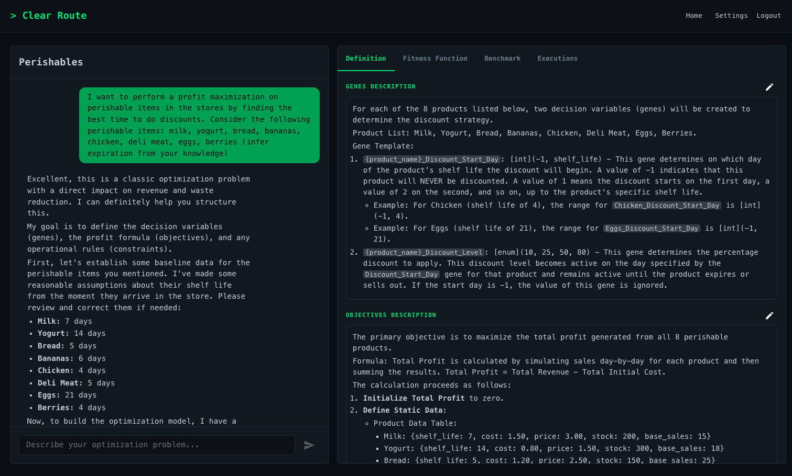
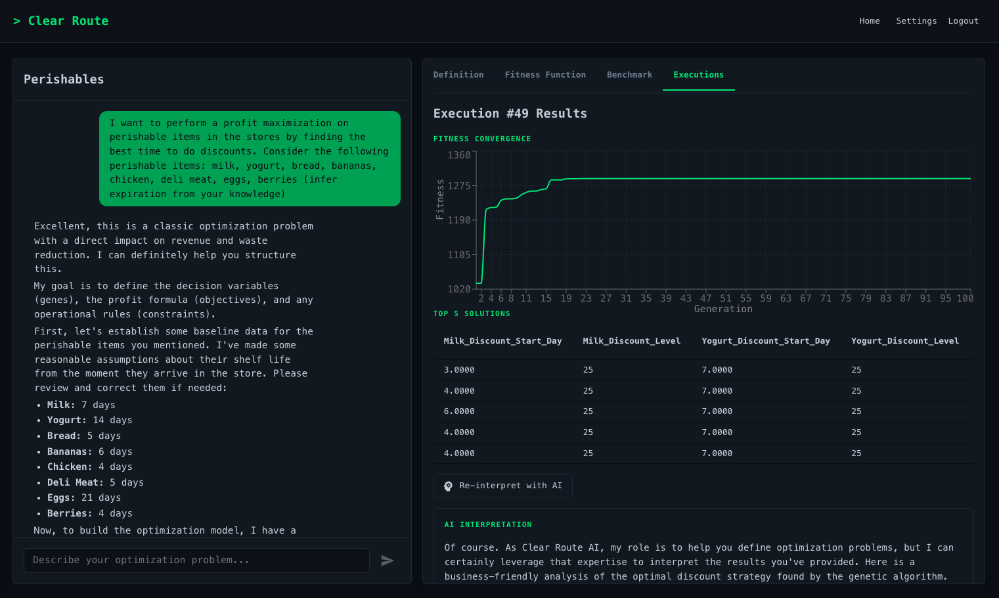

# > Clear Route

A web application that lets non-technical users define and run **business optimization problems** using **Genetic Algorithms**. An AI assistant translates natural language descriptions into optimization components (genes, objective functions, constraints) and generates executable Python code for [PyGAD](https://pygad.readthedocs.io/).

<p align="center">
  <br>
  <em>Define your problem in natural language – AI extracts genes, objectives, constraints</em>
</p>

<p align="center">
  <br>
  <em>After optimization, get clear, AI-generated explanations of results</em>
</p>


## How It Works

1. **Describe your problem** in the chat — the AI extracts genes (decision variables), objectives, and constraints
2. **Review definitions** — rendered as Markdown, editable when needed
3. **Benchmark** — test known inputs against the generated fitness function before running
4. **Execute** — run the genetic algorithm and view convergence graphs, Pareto fronts, or top solutions
5. **Interpret** — get AI-generated business-friendly explanations of the results

## Architecture

```
┌─────────────┐     ┌────────────┐     ┌────────────┐
│  Frontend   │────▶│  Backend   │────▶│ PostgreSQL │
│  React/MUI  │◀────│  FastAPI   │◀────│    16      │
│  :3000      │     │  :8000     │     │  :5432     │
└─────────────┘     └────────────┘     └────────────┘
```

Three Docker containers orchestrated via `docker-compose`:

| Service    | Stack                                         |
|------------|-----------------------------------------------|
| **Frontend** | React 18, Material UI 6, Recharts, react-markdown |
| **Backend**  | Python 3.12, FastAPI, SQLAlchemy, Alembic, PyGAD  |
| **Database** | PostgreSQL 16                                      |

## Quick Start

### Prerequisites

- [Docker](https://docs.docker.com/get-docker/) and [Docker Compose](https://docs.docker.com/compose/install/)

### Setup

```bash
# Clone the repository
git clone <repo-url> && cd Optimizer

# Copy environment config
cp .env.example .env

# Start all services
docker-compose up --build
```

The app will be available at:

| URL | Description |
|-----|-------------|
| http://localhost:3000 | Frontend |
| http://localhost:8000 | Backend API |
| http://localhost:8000/docs | Swagger API docs |

### First Run

1. Open http://localhost:3000 and **register** a new account
2. Go to **Settings** and configure your LLM provider (Gemini, OpenAI, Anthropic, or Ollama)
3. Create a new **project** and start describing your optimization problem in the chat

## LLM Providers

Users configure their own API keys in the Settings page. Supported providers:

| Provider | Requirements |
|----------|-------------|
| **OpenAI** | API key |
| **Anthropic** | API key |
| **Gemini** | API key |
| **Ollama** | Local server URL (no API key needed) |

## Development

```bash
# Start all services (with hot reload)
docker-compose up --build

# Start in background
docker-compose up -d --build

# View logs
docker-compose logs -f backend
docker-compose logs -f frontend

# Run database migrations
docker-compose exec backend alembic upgrade head

# Generate a new migration after model changes
docker-compose exec backend alembic revision --autogenerate -m "description"

# Access backend shell
docker-compose exec backend bash
```

## Project Structure

```
backend/
  app/
    main.py                # FastAPI app, CORS, router registration
    config.py              # Pydantic settings (env vars)
    database.py            # SQLAlchemy engine, session, Base
    models/                # ORM models (User, Project, ChatMessage, Gene, Execution, UserSettings)
    schemas/               # Pydantic request/response schemas
    routes/
      auth.py              # Register/login (JWT)
      projects.py          # Project CRUD + gene/fitness endpoints
      chat.py              # Chat with LLM, auto-update definitions
      benchmark.py         # Test fitness function with known inputs
      executions.py        # Run optimization (background task), poll progress
      settings.py          # LLM provider/key management
    services/
      llm.py               # Multi-provider LLM client + system prompts
      optimization.py      # PyGAD runner, gene loading, fitness compilation
      benchmark.py         # Single-solution fitness evaluation
  alembic/                 # Database migrations
frontend/
  src/
    api.js                 # Fetch wrapper with auth headers
    App.js                 # Router + dark console theme
    components/Layout.js   # AppBar with navigation
    pages/
      LoginPage.js         # Auth form
      RegisterPage.js      # Registration form
      HomePage.js          # Project list with create/delete
      ProjectPage.js       # Chat + Definition/Fitness/Benchmark/Executions tabs
      SettingsPage.js      # LLM provider configuration
```

## Environment Variables

| Variable | Default | Description |
|----------|---------|-------------|
| `POSTGRES_USER` | `clearroute` | Database username |
| `POSTGRES_PASSWORD` | `clearroute_dev` | Database password |
| `POSTGRES_DB` | `clearroute` | Database name |
| `DATABASE_URL` | `postgresql://clearroute:clearroute_dev@db:5432/clearroute` | SQLAlchemy connection string |
| `SECRET_KEY` | `change-me-in-production` | JWT signing key |

## Key Concepts

- **Genes** — Decision variables: numeric (int/float with boundaries) or enum (dropdown options)
- **Objectives** — What to optimize: single objective (min/max) or multi-objective (Pareto front)
- **Constraints** — Business rules the solution must satisfy
- **Fitness Function** — AI-generated Python code executed by PyGAD at runtime
- **Benchmark** — Pre-optimization testing of known inputs to validate the objective function

## Example: Perishable Goods Discount Optimization

Create a new project and paste this into the chat to get started:

> I want to do an optimization on the perishables in market stores to test when is the right time to make discounts and what is the discounted amount - help me frame the problem for at least 10 perishable items

The AI will frame this as a genetic algorithm problem. Here's what to expect:

### Genes (Decision Variables)

For each perishable item (e.g. milk, yogurt, bread, bananas, chicken, salad mix, berries, deli meat, fresh juice, eggs), the optimizer will define:

| Gene | Type | Range | Description |
|------|------|-------|-------------|
| `Discount_Day_Milk` | int | 1 - 5 | Day before expiry to start the discount |
| `Discount_Pct_Milk` | int | 5 - 70 | Discount percentage to apply |
| `Discount_Day_Yogurt` | int | 1 - 5 | Day before expiry to start the discount |
| `Discount_Pct_Yogurt` | int | 5 - 70 | Discount percentage to apply |
| ... | ... | ... | Same pattern for all 10 items |

This gives **20 genes** (2 per item) that the algorithm will optimize simultaneously.

### Objectives

- **Maximize revenue** — sell as many items as possible before they expire, accounting for the discount impact on margin
- **Minimize waste** — reduce the number of items that go unsold past their expiry date

This is a **multi-objective** optimization, so the result will be a Pareto front showing the trade-off between revenue and waste reduction.

### Constraints

- Discount cannot start earlier than the item's shelf life allows
- Minimum margin per item must remain above a threshold (e.g. no selling below cost)
- Total daily discount budget may be capped

### What You Get

After the AI generates the definitions and fitness function, you can:

1. **Benchmark** — test a specific discount strategy (e.g. "30% off milk on day 2") to see the fitness score
2. **Run optimization** — let the genetic algorithm find the best discount timing and amounts across all items
3. **View results** — convergence graph + Pareto front showing revenue vs. waste trade-offs
4. **Interpret** — get an AI explanation like *"The optimal strategy discounts dairy items 2 days before expiry at 25-35%, while bread should be discounted earlier at 15-20% due to its shorter shelf life"*

## License

MIT
